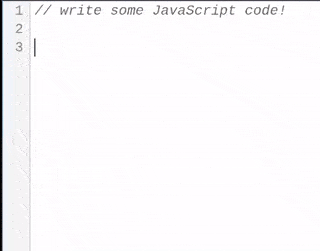

# Sween
Small and extensible code editing component for the web. Definitely stands for Simple Web Editing ENvironment and has no relations with [Tim Sweeney](https://en.wikipedia.org/wiki/Tim_Sweeney)

## Cool Stuff
- At least 50 times smaller than CodeMirror gzipped

## Limitations (as of Q4 2024)
- Syntax highlighting reconstructs the entire token list in the DOM with each edit, thus chokes on large documents. A new mechanism is urgently planned.
